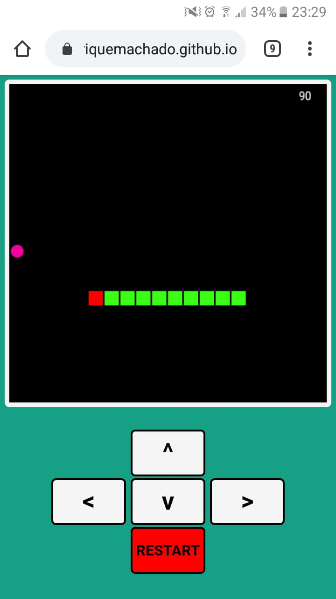
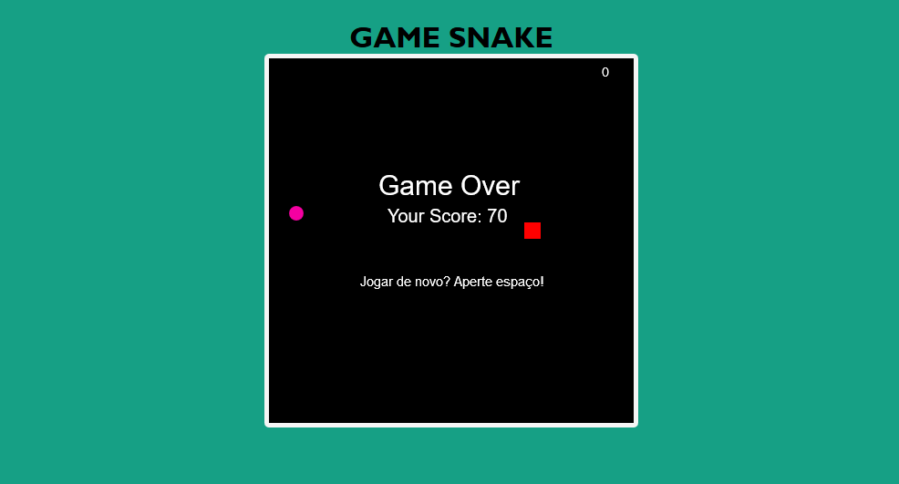

<h1 align="center">Snake Game</h1>
 

  

<strong><a href="https://caiohenriquemachado.github.io/Snake/index.html">ACESSAR</a></strong>

 

<h1 align="center">Mobile Version</h1>

  

 

<h1 align="center">Web responsive Version </h1>

  

 

 
  <h2 align="center">FEATURES :book:</h2>
 

- 📄 **HTML5** 		      - Para construir a estrutura do jogo.
- ⚛️ **CSS3** 	        - Para a estilização e personalização das estruturas na página web.
- 📊 **JavaScript**     - Para inserir a lógica do jogo.

 